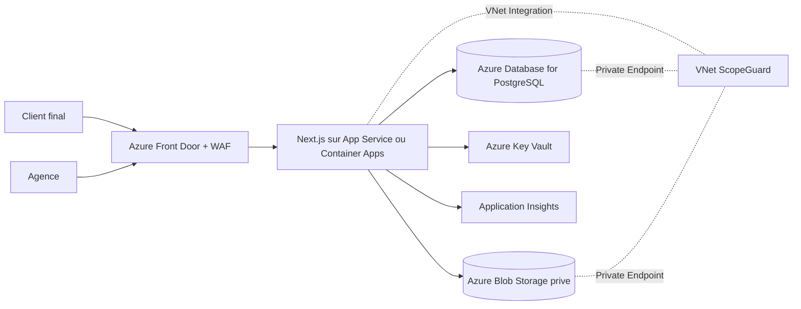

# Trajectoire de production ScopeGuard sur Azure

Ce document decrit la trajectoire entre le prototype actuel et une version de production hebergee dans l'organisation Azure. Il ne modifie pas la demo actuelle et sert de reference pour eviter les oublis lors de la migration.

## 1. Etat actuel du prototype

Le prototype est une application Next.js avec TypeScript et App Router.

- Application : Next.js 16 avec React.
- Validation actuelle : `npm.cmd run build` passe.
- Persistance : `localStorage` sous la cle `scopeguard-review-state`.
- Fichiers : PDF et images manipules cote navigateur.
- PDF : rendu multi-pages avec `react-pdf`.
- Viewer : zoom, deplacement, commentaires positionnes et plein ecran cote agence et client.
- Liens de revue : tokens conserves dans l'etat local, avec expiration automatique ou revocation manuelle.
- Synchronisation : evenement navigateur `storage` entre onglets.
- Preuve : export HTML imprimable ou enregistrable en PDF.
- Authentification : absente.
- API et base de donnees : absentes.

Cet etat est adapte a une demo personnelle dans un meme navigateur. Il ne constitue pas encore une persistance partagee entre une agence et un client sur des appareils differents.

## 2. Cible de production

### Architecture cible



### Services recommandes

| Besoin | Service cible | Principes |
| --- | --- | --- |
| Frontend et backend Next.js | Azure App Service Linux ou Azure Container Apps | Choisir App Service pour la simplicite ; Container Apps pour une trajectoire conteneurisee |
| Base de donnees | Azure Database for PostgreSQL Flexible Server | Acces prive, migrations versionnees, sauvegardes activees |
| Fichiers | Azure Blob Storage | Compte prive, conteneurs prives, versionnement et lifecycle management |
| Secrets | Azure Key Vault | Aucun secret dans le code ou les variables en clair |
| Identite agence | Microsoft Entra ID | Authentification, organisations et roles |
| Identite client | Entra External ID ou liens signes ScopeGuard | Choix a faire selon le niveau de securite et de friction souhaite |
| Entree publique | Azure Front Door + WAF | Point d'entree public protege vers une origine privee |
| Reseau | VNet, Private Endpoints, Private DNS Zones | PostgreSQL et Blob non exposes directement sur Internet |
| Observabilite | Azure Application Insights et Azure Monitor | Logs structures, erreurs, latence et alertes |
| Protection des fichiers | Managed Identity + User Delegation SAS | Acces temporaire et limite aux blobs |

Une application accessible par un client externe aura generalement un point d'entree public protege. L'origine, la base de donnees et le stockage peuvent rester prives dans le VNet. Une application entierement privee imposerait un VPN ou un acces reseau aux clients, ce qui ne correspond pas au parcours actuel par lien partageable.

## 3. Modele de donnees cible

Les donnees actuellement regroupees dans `scopeguard-review-state` devront etre separees en entites persistantes.

| Etat ou type actuel | Entite cible |
| --- | --- |
| `projects` | `Project` |
| `clients` | `Client` |
| `deliverables` | `Deliverable` |
| versions d'un livrable | `DeliverableVersion` |
| `reviewLinks` | `ReviewLink` |
| `comments` | `Comment` |
| decisions de perimetre | `ScopeDecision` |
| `proposalVersions` | `ChangeProposal` et `ChangeProposalVersion` |
| `proposalDecisions` | `ClientDecision` |
| `reviewStatus`, `approvedAt` | `Approval` ou `ReviewStatus` |
| `auditEvents` | `AuditEvent` append-only |
| `notifications` | `Notification` |
| `adaptationRequests` | `AdaptationRequest` |
| `fileData` | metadonnees + objet Blob |

Chaque objet important doit etre rattache a une organisation :

```text
Organization
  -> User
  -> Client
  -> Project
  -> Deliverable
  -> DeliverableVersion
  -> ReviewLink
  -> Comment
  -> Proposal
  -> Approval
  -> AuditEvent
```

Les commentaires, propositions, decisions et approbations doivent pointer vers la version exacte du livrable. Une nouvelle version ne doit jamais modifier une version approuvee.

## 4. Migration du stockage des fichiers

Le prototype stocke temporairement les PDF sous forme de `fileData` dans `localStorage`. En production :

```text
Blob path :
/{organizationId}/{projectId}/{deliverableId}/{version}/source.pdf
```

Metadonnees a conserver en base :

- `blobPath` ;
- `contentType` ;
- `size` ;
- `checksum` ;
- `createdAt` ;
- `pageCount` ;
- `viewport` pour les captures web ;
- statut de conservation et de suppression.

Regles :

- acces public aux blobs desactive ;
- HTTPS obligatoire ;
- identite managée pour le backend ;
- User Delegation SAS de duree limitee pour les lectures client ;
- versionnement Blob active ;
- lifecycle management pour les fichiers anciens ;
- suppression et export des donnees prevus pour le RGPD.

## 5. Migration fonctionnelle par phases

### Phase 0 - Prototype personnel

Objectif : demontrer le parcours sans infrastructure serveur.

- Conserver `localStorage`.
- Tester avec une demo personnelle Vercel ou en local.
- Ne pas utiliser de donnees client confidentielles.
- Garder le stockage PDF local limite aux demos.

### Phase 1 - Socle Azure de test

Objectif : preparer un environnement partage sans encore migrer toutes les fonctions.

- Creer un abonnement ou resource group dedie.
- Definir region, naming, tags et budgets.
- Creer le VNet et les subnets.
- Creer PostgreSQL prive.
- Creer Blob Storage prive.
- Creer Key Vault.
- Creer Application Insights.
- Definir Managed Identity pour l'application.
- Configurer Private DNS Zones et Private Endpoints.

### Phase 2 - Backend minimal partage

Objectif : remplacer les donnees critiques de `localStorage`.

- Ajouter Prisma ou Drizzle.
- Creer les migrations PostgreSQL.
- Implementer les routes serveur Next.js ou un backend dedie.
- Migrer projets, clients, livrables, versions et liens de revue.
- Ajouter une API de lecture client par token.
- Ajouter une API de commentaires.
- Ajouter une API de decisions et d'approbations.
- Conserver temporairement un mode demo local si necessaire.

### Phase 3 - Fichiers et revue client

Objectif : rendre le lien client utilisable sur un autre appareil.

- Upload du fichier vers Blob Storage.
- Generation de SAS temporaires.
- Lecture du fichier par le viewer agence et client.
- Conservation du lien entre Blob, version et checksum.
- Verification des anciennes versions et de leur verrouillage.
- Suppression de `fileData` du modele serveur.

### Phase 4 - Identite et securite

Objectif : isoler correctement les organisations et proteger les acces.

- Authentifier les membres agence avec Entra ID.
- Ajouter organisations, membres et roles.
- Valider chaque requete avec l'organisation courante.
- Garder les ReviewLinks aleatoires, expirables et revocables.
- Ne jamais faire confiance a un `organizationId` fourni par le navigateur.
- Ajouter rate limiting sur les liens et actions sensibles.
- Ajouter validation de taille et type des fichiers.
- Journaliser les actions sensibles en append-only.

### Phase 5 - Exposition reseau et production

Objectif : exposer le produit sans exposer directement les donnees.

- Deployer l'application sur App Service ou Container Apps.
- Connecter l'application au VNet.
- Garder PostgreSQL et Blob derriere Private Endpoints.
- Exposer l'application via Front Door + WAF.
- Configurer TLS, domaines et headers de securite.
- Ajouter alertes Application Insights.
- Tester les sauvegardes et la restauration.
- Tester revocation, expiration et isolation entre organisations.

## 6. Points de securite non negociables

- Ne jamais stocker de secrets dans le depot.
- Utiliser Managed Identity pour les services Azure.
- Utiliser Key Vault pour les secrets qui restent necessaires.
- Ne jamais rendre le conteneur Blob public.
- Ne jamais faire confiance aux identifiants envoyes par le client.
- Verifier organisation, projet, livrable et version sur chaque requete.
- Utiliser des tokens de revue imprevisibles, expirables et revocables.
- Limiter la duree des SAS.
- Valider taille, MIME type et extension des fichiers.
- Ajouter une protection contre les abus de liens publics.
- Conserver un audit des approbations, decisions, revocations et acces sensibles.
- Prevoir export et suppression des donnees conformes au RGPD.

## 7. Choix a ne pas faire trop tot

- Ne pas partir sur AKS pour le premier environnement de production.
- Ne pas ajouter Stripe avant d'avoir valide la retention.
- Ne pas construire un reverse proxy de pages web sans analyse SSRF approfondie.
- Ne pas exposer directement PostgreSQL ou Blob sur Internet.
- Ne pas migrer toute l'interface en une seule fois.
- Ne pas supprimer immediatement le mode demo `localStorage` tant que le backend partage n'est pas teste.

## 8. Criteres de passage en production

Le passage du prototype a la production est considere pret lorsque :

- deux navigateurs differents voient les memes projets et decisions ;
- un client peut ouvrir un lien depuis une autre machine ;
- un PDF est stocke dans Blob et non dans `localStorage` ;
- une version approuvee reste immuable ;
- une revocation rend le lien inutilisable ;
- une expiration rend le lien inutilisable ;
- les donnees de deux organisations sont strictement isolees ;
- les actions importantes sont auditables ;
- une sauvegarde PostgreSQL est testee en restauration ;
- les erreurs de stockage et de synchronisation sont visibles ;
- les logs et alertes sont consultables ;
- un test de securite des endpoints et des liens est passe.

## 9. Ordre recommande

```text
Prototype localStorage stable
    -> tests de parcours et pilotes personnels
    -> modele PostgreSQL et API minimale
    -> Blob Storage prive
    -> authentification agence
    -> isolation par organisation
    -> reseau prive et Private Endpoints
    -> Front Door + WAF
    -> observabilite et sauvegardes
    -> beta pilote
```

La demo actuelle reste volontairement simple. La production Azure doit reprendre le meme parcours utilisateur, mais remplacer progressivement la persistance locale par des services partages, securises et auditables.
