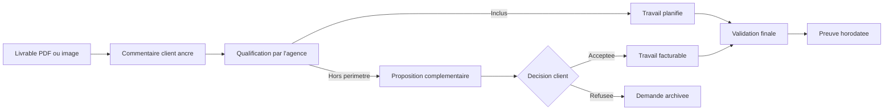

# Plan d'execution de ScopeGuard

Ce document transforme le positionnement defini dans [README.md](README.md) en plan d'action concret. ScopeGuard ne vise pas a devenir un outil generique de commentaires : il doit aider les agences a qualifier les demandes client, faire accepter les prestations hors perimetre et conserver une preuve de chaque decision.

## Priorite no 1 : valider le probleme avant de construire

Avant de developper une application complete, il faut demontrer que le probleme est suffisamment frequent, couteux et urgent pour des agences web.

### Objectif

Mener 15 a 20 entretiens avec des dirigeants, chefs de projet ou directeurs de production d'agences web de 3 a 30 personnes.

### Hypotheses a verifier

| Hypothese | Preuve attendue |
| --- | --- |
| Le hors perimetre fait perdre de l'argent | Exemples recents, heures non facturees, devis refuses trop tard |
| Le processus de validation est penible | E-mails, WhatsApp, PDF annotes, relances repetees |
| Les agences paieront une solution | Test sur un projet reel, engagement pilote, idealement pre-paiement |

### Questions d'entretien

- Sur vos trois derniers projets, quelles demandes n'etaient pas prevues au devis initial ?
- Combien d'heures non facturees ces demandes ont-elles represente ?
- Comment decidez-vous aujourd'hui si un retour est inclus ou hors perimetre ?
- Comment obtenez-vous l'accord du client avant de commencer une prestation supplementaire ?
- Pouvez-vous montrer un exemple anonymise d'e-mail ou de conversation qui a cree une ambiguite ?
- Accepteriez-vous de tester un prototype sur un projet client reel ?

Ne pas poser la question abstraite : "Utiliseriez-vous ce produit ?" La recherche doit etre basee sur des situations passees et des elements concrets.

### Signal de continuation

Continuer uniquement si plusieurs agences rapportent une perte de marge recurrente, acceptent de partager leur processus actuel et souhaitent tester le produit sur un projet actif.

L'objectif est de recruter 3 a 5 agences pilotes avant de construire un large ensemble de fonctionnalites.

## Le MVP

Le MVP doit permettre de tester un seul parcours complet : transformer un retour client en travail prevu ou en prestation supplementaire explicitement acceptee.

### Fonctions indispensables

| Domaine | Fonctions MVP |
| --- | --- |
| Comptes | Espaces agence, utilisateurs et roles de base |
| Clients et projets | Clients, projets, livrables et versions |
| Fichiers | Import d'images et de PDF |
| Revue client | Lien securise, commentaires ancres, reponses et resolution |
| Decisions | Qualification : incluse, modification mineure, hors perimetre ou a clarifier |
| Propositions | Creation d'une proposition complementaire depuis un commentaire |
| Accord client | Acceptation ou refus explicite, identite et horodatage |
| Preuve | Journal d'activite et export d'un recapitulatif |
| Communication | E-mails d'invitation et relances simples |

### Hors MVP

Ne pas construire ces elements avant d'avoir valide le flux principal :

- annotation et revue de video ;
- coedition en temps reel ;
- editeur de documents ;
- application mobile native ;
- connecteurs vers de nombreux outils ;
- intelligence artificielle de classification ;
- generation de contrats complexes ;
- gestion comptable complete.

L'integration Stripe peut venir apres validation du parcours commentaire -> proposition complementaire -> acceptation.

## Equipe minimale

| Role | Responsabilite |
| --- | --- |
| Fondateur produit et commercial | Entretiens, recrutements pilotes, priorites, demonstrations et support |
| Developpeur full-stack | Application, API, base de donnees, stockage, liens clients et historique |
| Designer produit | Parcours de revue client, interface agence, identite initiale |
| Conseil juridique ou comptable ponctuel | Donnees personnelles, mentions legales, cadre des preuves de validation |

Au debut, un binome fondateur produit/commercial et developpeur full-stack peut suffire. Le parcours client doit rester tres simple, y compris sur mobile, car la validation sera frequemment effectuee sans formation prealable.

## Architecture technique recommandee

Une stack rapide a livrer, maintenable et adaptee a un SaaS B2B :

| Besoin | Choix possible |
| --- | --- |
| Application frontend et backend | Next.js avec TypeScript |
| Authentification et organisations | Clerk, Supabase Auth ou Auth.js |
| Base de donnees | PostgreSQL |
| ORM | Prisma ou Drizzle |
| Stockage fichiers | Amazon S3, Cloudflare R2 ou Supabase Storage |
| Liens client | Jetons uniques, expirables et revocables |
| E-mails transactionnels | Resend ou Postmark |
| Taches differees | Inngest, Trigger.dev ou BullMQ |
| Paiements | Stripe Billing, puis Stripe Invoicing |
| Observabilite | Sentry et journalisation structuree |
| Hebergement | Vercel et services geres, ou equivalent |

Le principe technique non negociable est l'immuabilite d'une version approuvee. Un nouveau fichier doit toujours creer une nouvelle version. Les commentaires, classifications, propositions et decisions doivent referencer la version exacte concernee.

## Modele de donnees de base

| Entite | Responsabilite |
| --- | --- |
| `Organization` | Agence cliente de ScopeGuard |
| `User` | Membre de l'agence |
| `Client` | Client final de l'agence |
| `Project` | Mission regroupant les livrables |
| `Deliverable` | Element validable, par exemple une maquette ou un rapport |
| `DeliverableVersion` | Fichier precis soumis a la revue |
| `ReviewLink` | Acces client limite, securise et revocable |
| `Comment` | Remarque attachee a une page et des coordonnees |
| `ScopeDecision` | Qualification de la demande |
| `ChangeProposal` | Proposition complementaire, montant et impact planning |
| `ClientDecision` | Acceptation ou refus de la proposition |
| `Approval` | Validation finale de la version |
| `AuditEvent` | Evenement horodate, non modifiable |

La preuve est une fonction produit centrale, pas un simple journal technique. L'application doit pouvoir montrer clairement qui a demande quoi, sur quelle version, quelle decision a ete prise et a quel moment.

## Securite et conformite

Les livrables peuvent contenir des informations confidentielles, commerciales ou personnelles. Le MVP doit donc inclure les fondations suivantes :

- chiffrement des echanges HTTPS et chiffrement du stockage ;
- isolation stricte des donnees par organisation ;
- permissions par role : administrateur, chef de projet, membre ;
- liens de revue imprevisibles, revocables et eventuellement proteges par mot de passe ;
- expiration configurable des liens ;
- politique de conservation et de suppression des fichiers ;
- export et suppression des donnees sur demande ;
- journal d'audit append-only pour les actions importantes ;
- politique de confidentialite, conditions d'utilisation et mentions legales.

Pour une clientele europeenne, planifier le RGPD des le depart : contrats avec les sous-traitants, localisation des donnees, droits d'acces et d'effacement.

La validation obtenue dans ScopeGuard doit etre presentee comme une preuve operationnelle. Elle ne constitue pas automatiquement une signature electronique qualifiee ni un contrat juridiquement incontestable.

## Acquisition et monetisation

Le premier canal d'acquisition doit etre direct et qualitatif. La publicite payante est rarement efficace pour un SaaS a 49 a 119 USD par mois sans message deja valide.

Canaux de depart :

- reseau personnel et recommandations ;
- prospection LinkedIn ciblee vers fondateurs d'agences et directeurs de production ;
- communautes d'agences et de freelances ;
- partenariats avec consultants specialises dans les agences ;
- demonstrations fondees sur des exemples reels anonymises ;
- contenus pratiques : modele de politique de revisions, modele de processus de validation, calculateur de cout du hors perimetre.

Offre pilote suggeree : 49 USD par mois, accompagnement direct, tarif garanti pendant un an, en echange de retours reguliers et de l'autorisation d'utiliser un retour d'experience anonymise.

## Mesures de succes

| Mesure | Pourquoi elle compte |
| --- | --- |
| Taux d'ouverture des liens de revue | Confirme que les clients acceptent le nouveau canal |
| Delai moyen jusqu'a approbation | Mesure la reduction de friction et de relances |
| Demandes hors perimetre par projet | Mesure la frequence du probleme traite |
| Taux d'acceptation des propositions | Mesure la valeur commerciale du flux |
| Montant supplementaire accepte | Montre le revenu protege ou recupere |
| Temps passe aux relances | Montre le gain operationnel |
| Projets avec preuve de validation complete | Mesure la valeur de tracabilite |
| Retention des agences pilotes | Confirme que la valeur est recurrente |

## Jalons de decision

| Etape | Livrable | Critere pour avancer |
| --- | --- | --- |
| Recherche | 15 a 20 entretiens et exemples de cas reels | Problemes recurrents, couteux et confirmes |
| Pilote manuel | Flux teste avec Figma, e-mail et document de suivi | 3 a 5 agences utilisent le processus sur un projet reel |
| MVP | Commentaire -> qualification -> proposition -> accord | Utilisation recurrente et retours sur de vrais livrables |
| Beta payante | 5 a 10 agences clientes | Volonte de payer et retention initiale |
| Version 1 | Paiements, reporting et integrations ciblees | Acquisition acceleree seulement apres retention |

## Prochaines actions

1. Identifier 30 agences web francophones de 3 a 30 personnes.
2. Contacter les decideurs pour obtenir 15 entretiens de 30 minutes.
3. Documenter les cas reels : type de livrable, demande, reponse actuelle, cout estime, issue commerciale.
4. Creer un prototype manuel du parcours de qualification et de proposition complementaire.
5. Tester le prototype avec 3 agences pilotes sur des projets en cours.
6. Ecrire le cahier des charges du MVP seulement apres cette phase de recherche.
